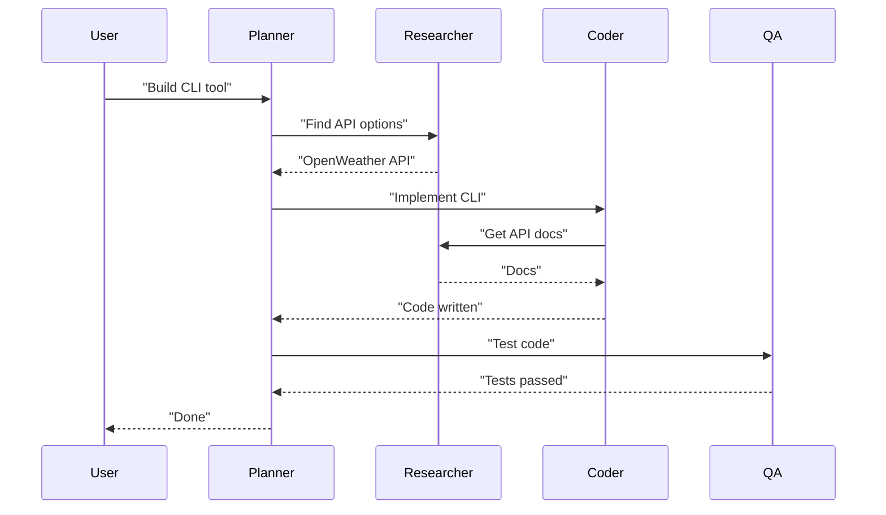

# Agents

## Core Agents

| Agent | Role | Default Provider | Tools |
|-------|------|------------------|-------|
| **Coder** | Write/review code | GPT-4o / Claude 3.5 | FileSystem, GitHub |
| **Browser** | Web automation | Claude 3.5 Sonnet | Browser, Web Fetch |
| **Researcher** | Gather information | Gemini 2.5 / GPT-4o | Web Search, Web Fetch |
| **Planner** | Decompose goals | GPT-4o / DeepSeek | None (meta-agent) |
| **QA** | Test/validate | Claude 3.5 Haiku | FileSystem, GitHub |
| **Memory** | Manage memory | GPT-4o mini | All memory backends |
| **Coordinator** | Route tasks | GPT-4o | Registry, Event Bus |

## Implementation

### Agent Lifecycle

```
Idle → Active → Processing → Waiting → Active → Idle → Sleeping
                 ↓                                 ↓
              Tool Call                       Task Complete
```

### Agent Config

```typescript
export interface AgentConfig {
  id: string
  name: string
  role: string
  systemPrompt: string
  provider: string
  model: string
  tools: string[]
  memoryScope: string[]
  allowedPeers: string[]
  limits: {
    maxTokensPerTask: number
    maxConsecutiveCalls: number
    timeout: number
  }
}
```

### Communication Protocol

```typescript
export interface AgentMessage {
  id: string
  from: string
  to: string | string[]
  type: 'request' | 'response' | 'broadcast' | 'error'
  priority: 'low' | 'medium' | 'high' | 'critical'
  payload: { task?: string; data?: unknown; context?: Record<string, unknown> }
  metadata: { timestamp: string; ttl: number; traceId: string; parentId?: string }
}
```

### Flow



### Custom Agent

```typescript
import { BaseAgent } from '@chakravyuh/core'

export class SlackAgent extends BaseAgent {
  async onMessage(message: AgentMessage): Promise<AgentMessage> {
    const result = await this.tools.slack.send(message.payload.data)
    return this.reply(message, { data: result })
  }
}
```

Register in config:

```yaml
agents:
  slack:
    class: "./agents/slack"
    provider: openai
    model: gpt-4o
    tools: ["slack-mcp"]
```

## Best Practices

1. Single responsibility per agent
2. Explicit capabilities — document what each agent can do
3. Restrict tool access to minimum required
4. Graceful degradation on provider failure
5. Log all decisions and actions
6. Handle duplicate messages safely (idempotency)
7. Always enforce timeouts
