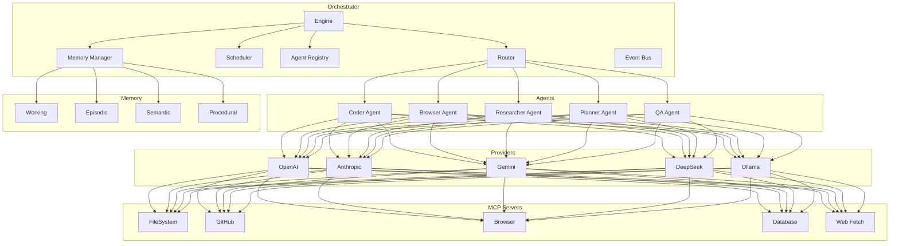

# Architecture

## Layered Design

Chakravyuh AI uses a layered microkernel architecture: orchestrator → agents → providers → MCP servers.



## Implementation

### Provider Interface

```typescript
// backend/src/providers/types.ts
export interface ProviderConfig {
  id: string
  apiKey?: string
  model: string
  defaults: {
    temperature: number
    maxTokens: number
  }
  rateLimit?: {
    requestsPerMinute: number
    tokensPerMinute: number
  }
}

export interface CompletionRequest {
  messages: Array<{ role: string; content: string }>
  tools?: ToolCall[]
  stream?: boolean
}

export interface CompletionResponse {
  content: string
  toolCalls?: ToolCall[]
  usage: { promptTokens: number; completionTokens: number }
}
```

### Agent Registry

```typescript
// backend/src/registry/types.ts
export interface AgentDefinition {
  id: string
  name: string
  systemPrompt: string
  provider: string
  model: string
  tools: string[]
  memoryScope: ('working' | 'episodic' | 'semantic' | 'procedural')[]
  allowedPeers: string[]
  limits: {
    maxTokensPerTask: number
    maxConsecutiveCalls: number
    timeout: number
  }
}
```

### Message Router

```typescript
// backend/src/router/router.ts
export interface AgentMessage {
  id: string
  from: string
  to: string | string[]
  type: 'request' | 'response' | 'broadcast' | 'error'
  priority: 'low' | 'medium' | 'high' | 'critical'
  payload: {
    task?: string
    data?: unknown
    context?: Record<string, unknown>
  }
  metadata: {
    timestamp: string
    ttl: number
    traceId: string
    parentId?: string
  }
}

export class MessageRouter {
  async dispatch(message: AgentMessage): Promise<void> {
    const targets = Array.isArray(message.to) ? message.to : [message.to]
    for (const target of targets) {
      await this.send(target, message)
    }
  }

  private async send(agentId: string, message: AgentMessage): Promise<void> {
    const agent = this.registry.get(agentId)
    if (!agent) throw new Error(`Agent ${agentId} not found`)
    await agent.receive(message)
  }
}
```

### Workflow Scheduler

```yaml
# config/workflows/example.yaml
workflow:
  id: code-review-pipeline
  steps:
    - agent: coder
      task: "Implement feature X"
      output: code

    - agent: qa
      task: "Review {{ steps.coder.output }}"
      depends_on: coder
      gates:
        - type: human_approval
          message: "Approve code changes?"

    - agent: researcher
      task: "Research best practices for {{ steps.coder.output }}"
      depends_on: qa
      parallel: true

    - agent: planner
      task: "Summarize results from {{ steps.qa.output }} and {{ steps.researcher.output }}"
      depends_on: [qa, researcher]
```

### Memory Interface

```typescript
// backend/src/memory/types.ts
export interface MemoryStore {
  save(key: string, value: unknown, ttl?: number): Promise<void>
  load(key: string): Promise<unknown | null>
  search(query: string, limit?: number): Promise<Array<{ key: string; score: number }>>
  delete(key: string): Promise<void>
  clear(namespace?: string): Promise<void>
}

// Episodic: conversation history (SQLite)
// Semantic: knowledge storage (vector DB)
// Working: session state (Redis)
// Procedural: prompts and workflows (file system)
```

## Data Flow

```
User → API → Orchestrator → Router → Agent → Provider → MCP Server
                                                          ↓
Agent ← Provider ← MCP Result ←──────────────────────────┘
    ↓
Memory ← Agent stores interaction
    ↓
Orchestrator ← Router ← Result
    ↓
User ← API
```

## Directory Layout

```
backend/src/
├── orchestrator/    # Core engine
├── router/         # Message routing
├── scheduler/      # Workflow execution
├── registry/       # Agent/service registry
├── providers/      # Provider implementations
│   ├── openai/
│   ├── anthropic/
│   ├── google/
│   ├── deepseek/
│   └── ollama/
├── memory/         # Memory backends
├── mcp/            # MCP client
├── api/            # HTTP/WS API
└── events/         # Event bus

agents/              # Agent code
mcp/servers/         # MCP server implementations
memory/drivers/      # Storage drivers
```
