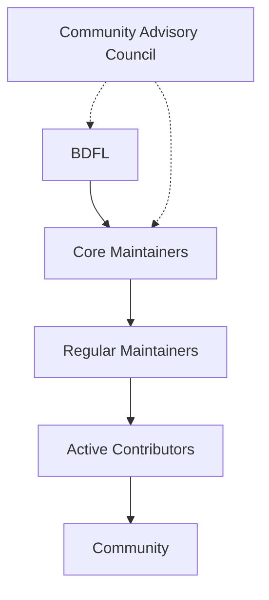

# Governance

## Model

BDFL (Benevolent Dictator for Life) with growing community involvement, transitioning to distributed governance as the project matures.

## Structure



## Roles

| Role | Responsibilities |
|------|------------------|
| **BDFL** | Strategic direction, final decisions, dispute resolution |
| **Core Maintainer** | Architecture, code review, releases, mentoring |
| **Regular Maintainer** | Area ownership, PR review, issue triage |
| **Active Contributor** | Regular PRs, community support |
| **Community Contributor** | Occasional PRs, bug reports, discussions |

## Decision Making

1. **RFC process**: Significant changes require a GitHub Discussion with `[RFC]` prefix
2. **Lazy consensus**: Default approval — 7 days without objection
3. **Escalation**: BDFL decides if consensus fails

## Voting

| Matter | Voters | Threshold |
|--------|--------|-----------|
| New core maintainer | Core + BDFL | 2/3 |
| New regular maintainer | Core | Majority |
| Release approval | Core + BDFL | BDFL approve |
| RFC approval | Core | Majority after 7d |
| BDFL succession | All maintainers | 3/4 |

## Progression

```
Community → Active → Regular → Core → BDFL
```

| Step | Criteria |
|------|----------|
| Active | 10+ merged PRs |
| Regular | 3+ months active, 20+ reviews, area expertise |
| Core | 6+ months as maintainer, architectural contributions |

## License

All contributions are under [Apache 2.0](LICENSE).

## Amendments

Amended by 2/3 core vote with BDFL approval.
