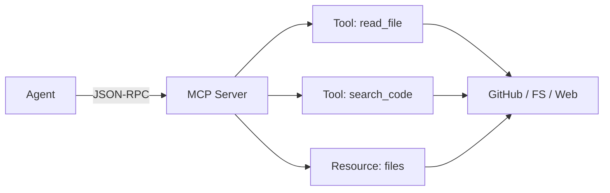

# MCP Servers

Model Context Protocol (MCP) provides a standardized way for agents to interact with tools and data sources.

## Architecture



## FileSystem Server

| Tool | Parameters |
|------|------------|
| `read_file` | `path: string` |
| `write_file` | `path, content: string` |
| `edit_file` | `path, old, new: string` |
| `list_directory` | `path: string` |
| `create_directory` | `path: string` |
| `delete_file` | `path: string` |
| `move_file` | `source, destination: string` |
| `search_files` | `pattern, path: string` |

```json
{
  "server": "filesystem",
  "command": "npx -y @modelcontextprotocol/server-filesystem",
  "allowedDirectories": ["./workspace"]
}
```

## GitHub Server

| Tool | Parameters |
|------|------------|
| `create_or_update_file` | `owner, repo, path, content, message` |
| `push_files` | `owner, repo, branch, files[]` |
| `search_repositories` | `query` |
| `create_issue` | `owner, repo, title, body` |
| `create_pull_request` | `owner, repo, title, body, head, base` |
| `list_issues` | `owner, repo, state` |
| `search_code` | `query` |

```json
{
  "server": "github",
  "command": "npx -y @modelcontextprotocol/server-github",
  "env": { "GITHUB_TOKEN": "${GITHUB_TOKEN}" }
}
```

## Browser Server

| Tool | Parameters |
|------|------------|
| `navigate` | `url: string` |
| `click` | `selector: string` |
| `type` | `selector, text: string` |
| `extract` | `selector: string` |
| `screenshot` | `selector?: string` |
| `scroll` | `direction, amount` |
| `get_html` | — |

```json
{
  "server": "browser",
  "command": "npx -y @anthropic/server-browser",
  "env": { "HEADLESS": "true" }
}
```

## Web Fetch Server

| Tool | Parameters |
|------|------------|
| `fetch` | `url, headers?: object` |
| `search` | `query, count?: number` |

```json
{ "server": "web-fetch", "command": "npx -y @anthropic/server-web-fetch" }
```

## Database Server

| Tool | Parameters |
|------|------------|
| `query` | `sql: string` |
| `list_tables` | — |
| `describe_table` | `table: string` |

```json
{
  "server": "database",
  "command": "npx -y @anthropic/server-postgres",
  "env": { "DATABASE_URL": "${DATABASE_URL}" }
}
```

## Custom MCP Server

### Python

```python
from mcp.server import Server

server = Server("my-server")

@server.list_tools()
async def list_tools():
    return [Tool(name="my_tool", description="...",
                 inputSchema={"type": "object", "properties": {"param": {"type": "string"}}})]

@server.call_tool()
async def call_tool(name: str, arguments: dict):
    return [TextContent(type="text", text="result")]
```

### Node.js

```typescript
import { Server } from '@modelcontextprotocol/sdk/server/index.js'
import { StdioServerTransport } from '@modelcontextprotocol/sdk/server/stdio.js'

const server = new Server({ name: 'my-server', version: '1.0.0' },
  { capabilities: { tools: {} } })

server.setRequestHandler(CallToolRequestSchema, async (req) => {
  return { content: [{ type: 'text', text: 'done' }] }
})

await server.connect(new StdioServerTransport())
```

## Configuration

```yaml
servers:
  filesystem:
    enabled: true
    autoStart: true
    args: ["--allowed", "./workspace"]
  github:
    enabled: true
    autoStart: false
    env: { GITHUB_TOKEN: "${GITHUB_TOKEN}" }
  browser:
    enabled: false
```

## CLI

```bash
chakravyuh mcp start filesystem
chakravyuh mcp list
chakravyuh mcp stop filesystem
```

## Security

| Concern | Mitigation |
|---------|------------|
| File access | Restrict to allowed directories |
| Credentials | Environment variables only |
| Injection | Validate all tool parameters |
| Resources | Set timeouts and rate limits |
