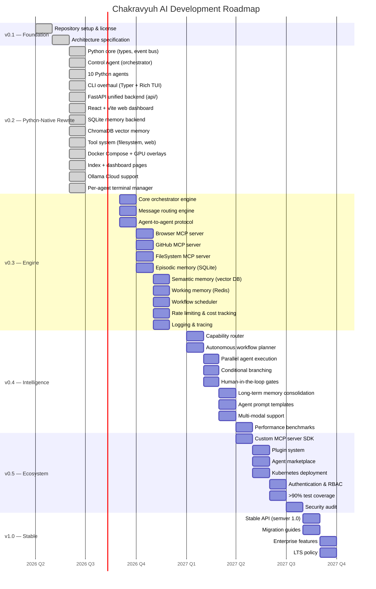

# Roadmap

> **Phase**: Alpha · Q2–Q3 2026
> **Status**: v0.2 Python-native rewrite complete — 10 agents, FastAPI, CLI/TUI, cloud support

---

## Milestone Timeline



---

## v0.1 — Foundation (Q2 2026)

**Goal**: Establish the core architecture and development infrastructure.

| Area | Item | Status |
|------|------|--------|
| Infrastructure | Repository setup and license | ✅ |
| Architecture | Core architecture specification | ✅ |

---

## v0.2 — Python-Native Rewrite (Q2–Q3 2026)

**Goal**: Complete Python-native rewrite — CLI, API, agents, tools, memory, cloud support.

| Area | Item | Status |
|------|------|--------|
| Core | Type definitions & enums | ✅ |
| Core | Async event bus with history | ✅ |
| Core | Base agent with async worker loop | ✅ |
| Core | Control Agent (task decomposition) | ✅ |
| Core | Orchestrator (lifecycle management) | ✅ |
| Core | Terminal manager (per-agent PTY subprocesses) | ✅ |
| Core | Prompt engineer (keyword routing + prompt crafting) | ✅ |
| Agents | 10 specialized agents with real handlers | ✅ |
| CLI | Typer entrypoint (9 commands) | ✅ |
| CLI | Textual multi-pane TUI | ✅ |
| CLI | Ollama manager (local + cloud) | ✅ |
| API | FastAPI with lifespan orchestrator | ✅ |
| API | Routes: system, agents, models, memory, chat | ✅ |
| Tools | Filesystem, WebFetch, WebSearch, Terminal, GitHub, Docker, MCP | ✅ |
| Memory | InMemory, SQLite, ChromaDB backends | ✅ |
| Web | React + Vite dashboard | ✅ |
| Docker | Dockerfile, docker-compose, GPU overlays | ✅ |
| Markdown | index.html (marketing) + dashboard.html (control center) | ✅ |
| Cloud | Ollama Cloud support (no GPU, no local downloads) | ✅ |
| Config | .env.example with Ollama Cloud + provider keys | ✅ |

### v0.2 Deliverables

- [x] Python type system with all enums and dataclasses
- [x] Async event bus with publish/subscribe and history
- [x] Abstract BaseAgent with worker loop, message queue, status
- [x] Control Agent with keyword-based task routing
- [x] Orchestrator with full lifecycle management (start/stop/status)
- [x] Terminal manager — 10 per-agent PTY subprocesses
- [x] Prompt engineer — task analysis + prompt crafting + terminal dispatch
- [x] 10 Python agents (Coordinator, Planner, Coder, Researcher, Browser, QA, Memory, Security, GitHub, Deployment)
- [x] Typer CLI with 9 commands (setup, run, tui, status, models, chat, task, agents, term)
- [x] Textual TUI with multi-pane agent grid (F1-F10 switching)
- [x] FastAPI app with lifespan, CORS, health, static serving
- [x] 5 REST route modules (system, agents, models, memory, chat)
- [x] 7 tool implementations (Filesystem, WebFetch, WebSearch, Terminal, GitHub, Docker, MCP)
- [x] 3 memory backends (InMemory, SQLite, ChromaDB)
- [x] React + Vite web dashboard
- [x] Docker Compose with CPU and GPU (NVIDIA + AMD) support
- [x] Marketing index.html + agent control center dashboard.html
- [x] Ollama Cloud support (host + API key auth)
- [x] Per-agent terminal with sandbox directories and file permissions

---

## v0.3 — Engine (Q3–Q4 2026)

**Goal**: Build the core runtime — orchestrator, routing, agent communication, and memory.

| Area | Item | Priority |
|------|------|----------|
| Core | Core orchestrator engine | P0 |
| Core | Message routing engine | P0 |
| Core | Agent-to-agent protocol | P0 |
| MCP | Browser MCP server | P1 |
| MCP | GitHub MCP server | P1 |
| MCP | FileSystem MCP server | P1 |
| Memory | Episodic memory (SQLite) | P0 |
| Memory | Semantic memory (vector DB) | P0 |
| Memory | Working memory (Redis) | P1 |
| Workflow | Sequential workflow executor | P1 |
| Observability | Rate limiting and cost tracking | P1 |
| Observability | Logging and tracing | P1 |

---

## v0.4 — Intelligence (Q1–Q2 2027)

**Goal**: Add autonomous capabilities — dynamic routing, planning, parallel execution.

| Area | Item | Priority |
|------|------|----------|
| Routing | Capability-based model router | P0 |
| Workflow | Autonomous workflow planner | P0 |
| Workflow | Parallel agent execution | P1 |
| Workflow | Conditional branching | P1 |
| Workflow | Human-in-the-loop gates | P1 |
| Memory | Long-term memory consolidation | P1 |
| Agents | Agent prompt templates | P1 |
| Models | Multi-modal support (images, audio) | P2 |
| Performance | Performance benchmarks | P2 |

---

## v0.5 — Ecosystem (Q2–Q3 2027)

**Goal**: Build the ecosystem — plugin system, marketplace, enterprise features.

| Area | Item | Priority |
|------|------|----------|
| Ecosystem | Custom MCP server SDK | P1 |
| Ecosystem | Plugin system | P1 |
| Ecosystem | Agent marketplace | P2 |
| Deployment | Kubernetes deployment | P1 |
| Security | Authentication and RBAC | P1 |
| Quality | >90% test coverage | P1 |
| Security | Security audit | P1 |

---

## v1.0 — Stable (Q3–Q4 2027)

**Goal**: Production-ready release with stable API, documentation, and LTS.

| Area | Item | Priority |
|------|------|----------|
| API | Stable public API (semver 1.0) | P0 |
| Documentation | Migration guides | P1 |
| Enterprise | Enterprise feature set | P2 |
| Governance | LTS policy | P1 |

---

## Progress Summary

```
v0.1 Foundation    ████████████████████████████████ 100%
v0.2 Python Rewrite████████████████████████████████ 100%
v0.3 Engine        ░░░░░░░░░░░░░░░░░░░░░░░░░░░░░░░░   0%
v0.4 Intelligence  ░░░░░░░░░░░░░░░░░░░░░░░░░░░░░░░░   0%
v0.5 Ecosystem     ░░░░░░░░░░░░░░░░░░░░░░░░░░░░░░░░   0%
v1.0 Stable        ░░░░░░░░░░░░░░░░░░░░░░░░░░░░░░░░   0%
```
