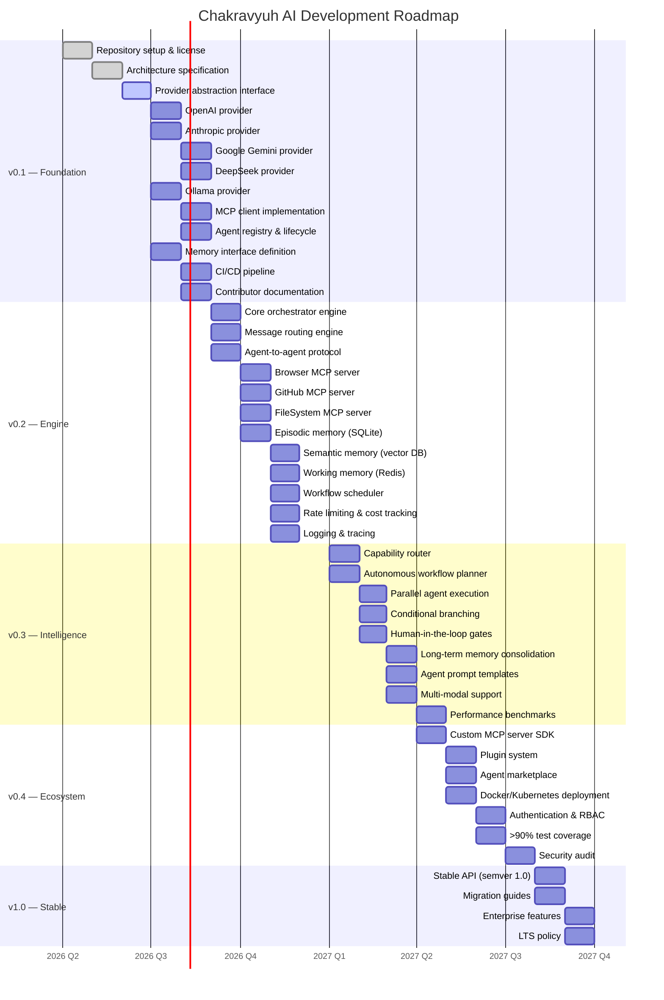

# Roadmap

> **Phase**: Pre-Alpha · Q2–Q4 2026
> **Status**: Architecture & Planning

---

## Milestone Timeline

---

## v0.1 — Foundation (Q2–Q3 2026)

**Goal**: Establish the core architecture, provider interfaces, and development infrastructure.

| Area | Item | Status | Priority |
|------|------|--------|----------|
| Infrastructure | Repository setup and license | ✅ Complete | P0 |
| Architecture | Core architecture specification | ✅ Complete | P0 |
| Architecture | Provider abstraction interface | 🔨 In Progress | P0 |
| Provider | OpenAI provider implementation | 📋 Planned | P0 |
| Provider | Anthropic provider implementation | 📋 Planned | P0 |
| Provider | Google Gemini provider implementation | 📋 Planned | P0 |
| Provider | DeepSeek provider implementation | 📋 Planned | P1 |
| Provider | Ollama provider implementation | 📋 Planned | P0 |
| Core | MCP client implementation | 📋 Planned | P0 |
| Core | Agent registry and lifecycle | 📋 Planned | P0 |
| Core | Memory interface definition | 📋 Planned | P0 |
| DevOps | CI/CD pipeline | 📋 Planned | P1 |
| Community | Contributor documentation | 📋 Planned | P1 |

### v0.1 Deliverables

- [x] Repository initialization with Apache 2.0 license
- [x] Architecture specification with Mermaid diagrams
- [ ] Provider abstraction interface (`LLMProvider`)
- [ ] OpenAI provider (GPT-4o, GPT-4o-mini, o1, o1-mini)
- [ ] Anthropic provider (Sonnet 4, Haiku 3.5)
- [ ] Google provider (Gemini 2.5 Pro, Gemini 2.0 Flash)
- [ ] DeepSeek provider (chat, coder, reasoner)
- [ ] Ollama provider (llama3, mistral, codellama, etc.)
- [ ] MCP client with connection pooling
- [ ] Agent registry with CRUD operations
- [ ] Memory interface (working, episodic, semantic, procedural)
- [ ] CI/CD with lint, typecheck, test, security audit
- [ ] Contributor documentation (CONTRIBUTING.md, setup guide)

---

## v0.2 — Engine (Q3–Q4 2026)

**Goal**: Build the core runtime — orchestrator, routing, agent communication, and memory.

| Area | Item | Priority |
|------|------|----------|
| Core | Core orchestrator engine | P0 |
| Core | Message routing engine | P0 |
| Core | Agent-to-agent protocol | P0 |
| MCP | Browser MCP server | P1 |
| MCP | GitHub MCP server | P1 |
| MCP | FileSystem MCP server | P1 |
| Memory | Episodic memory (SQLite) | P0 |
| Memory | Semantic memory (vector DB) | P0 |
| Memory | Working memory (Redis) | P1 |
| Workflow | Sequential workflow executor | P1 |
| Observability | Rate limiting and cost tracking | P1 |
| Observability | Logging and tracing | P1 |

### v0.2 Deliverables

- [ ] Orchestrator engine with lifecycle management
- [ ] Message router with priority queue
- [ ] Agent-to-agent structured communication protocol
- [ ] FileSystem MCP server (sandboxed)
- [ ] GitHub MCP server
- [ ] Browser MCP server (Playwright-based)
- [ ] Episodic memory with SQLite driver
- [ ] Semantic memory with vector DB driver (pgvector/Qdrant)
- [ ] Working memory with Redis driver
- [ ] YAML-based workflow definition and execution
- [ ] Per-provider rate limiting (sliding window)
- [ ] Per-task token cost tracking
- [ ] OpenTelemetry integration

---

## v0.3 — Intelligence (Q1–Q2 2027)

**Goal**: Add autonomous capabilities — dynamic routing, planning, parallel execution.

| Area | Item | Priority |
|------|------|----------|
| Routing | Capability-based model router | P0 |
| Workflow | Autonomous workflow planner | P0 |
| Workflow | Parallel agent execution | P1 |
| Workflow | Conditional branching | P1 |
| Workflow | Human-in-the-loop gates | P1 |
| Memory | Long-term memory consolidation | P1 |
| Agents | Agent prompt templates | P1 |
| Models | Multi-modal support (images, audio) | P2 |
| Performance | Performance benchmarks | P2 |

### v0.3 Deliverables

- [ ] Capability router (cost-aware, fallback, ensemble strategies)
- [ ] Autonomous planner agent that decomposes goals
- [ ] Parallel agent execution with result merging
- [ ] Conditional branching in workflows (if/else, switch)
- [ ] Human approval gates for sensitive operations
- [ ] Memory consolidation (auto-summarization, forgetting curves)
- [ ] Agent system prompt template library
- [ ] Image input support for vision-capable models
- [ ] Benchmark suite (latency, cost, quality)

---

## v0.4 — Ecosystem (Q2–Q3 2027)

**Goal**: Build the ecosystem — plugin system, marketplace, enterprise features.

| Area | Item | Priority |
|------|------|----------|
| Ecosystem | Custom MCP server SDK | P1 |
| Ecosystem | Plugin system | P1 |
| Ecosystem | Agent marketplace | P2 |
| Deployment | Docker/Kubernetes deployment | P1 |
| Security | Authentication and RBAC | P1 |
| Quality | >90% test coverage | P1 |
| Security | Security audit | P1 |

### v0.4 Deliverables

- [ ] MCP server SDK (Python + TypeScript)
- [ ] Plugin system for third-party agent registration
- [ ] Agent marketplace with versioning and ratings
- [ ] Docker Compose and Helm charts
- [ ] JWT-based authentication with role-based access
- [ ] 90%+ line coverage across all modules
- [ ] Third-party security audit report

---

## v1.0 — Stable (Q3–Q4 2027)

**Goal**: Production-ready release with stable API, documentation, and LTS.

| Area | Item | Priority |
|------|------|----------|
| API | Stable public API (semver 1.0) | P0 |
| Documentation | Migration guides | P1 |
| Enterprise | Enterprise feature set | P2 |
| Governance | LTS policy | P1 |

### v1.0 Deliverables

- [ ] Stable API surface with deprecation policy
- [ ] Migration guides from v0.x
- [ ] Enterprise features (SSO, audit trails, compliance)
- [ ] LTS release policy and schedule
- [ ] Full documentation site

---

## Priority Matrix

| Area | v0.1 | v0.2 | v0.3 | v0.4 | v1.0 |
|------|------|------|------|------|------|
| **Provider Abstraction** | P0 | — | — | — | — |
| **Core Orchestrator** | — | P0 | — | — | — |
| **Agent Communication** | — | P0 | — | — | — |
| **Memory Systems** | P1 | P0 | P1 | — | — |
| **Capability Routing** | — | — | P0 | — | — |
| **Autonomous Workflows** | — | P1 | P0 | — | — |
| **Plugin System** | — | — | — | P1 | — |
| **Security** | P1 | P1 | P1 | P1 | P0 |
| **Documentation** | P1 | P1 | P1 | P1 | P0 |
| **Testing** | P2 | P1 | P1 | P1 | P0 |
| **Deployment** | — | — | — | P1 | P0 |
