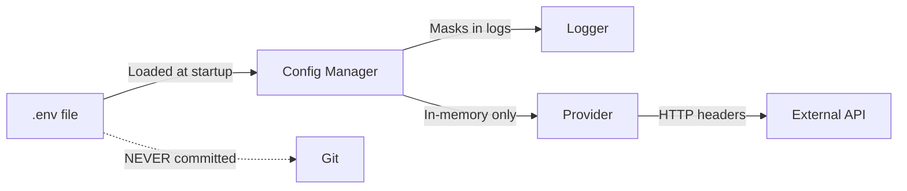

# Security Policy

---

## Reporting a Vulnerability

**Do not** open public issues for security vulnerabilities. Report privately:

- **Email**: security@chakravyuh.dev
- **GitHub**: [Security Advisory](https://github.com/krushna081/chakravyuh-ai/security/advisories/new)

### Response Timeline

| Timeframe | Action |
|-----------|--------|
| 24 hours | Acknowledgment of receipt |
| 7 days | Initial assessment and severity classification |
| 30 days | Critical/high severity patch release |
| 90 days | Medium/low severity patch release |

---

## Supported Versions

| Version | Status |
|---------|--------|
| 0.1.0-alpha | Security patches |
| Older versions | Not supported |

---

## Security Architecture

### API Key Management

**Rules:**
- Never commit API keys to version control
- Use `.env` files with `.env.example` as template
- Keys stored in memory only, never written to disk
- Keys are masked/redacted in all logs and error messages
- Support for read-only API keys where available

### Agent Security

| Concern | Mitigation |
|---------|------------|
| Prompt injection | Input sanitization, instruction reinforcement, anomaly detection |
| Tool misuse | Capability-based access control per agent |
| Data leakage | Memory scope isolation, per-agent namespace |
| Infinite loops | Max consecutive calls, timeout enforcement |
| Peer impersonation | Signed messages via event bus |
| Resource exhaustion | Token budgets, rate limiting, concurrent request limits |

### MCP Security

| Concern | Mitigation |
|---------|------------|
| File access | Restricted to allowed directories only |
| Credentials | Environment variables only, never hardcoded |
| Command injection | Strict schema validation with Zod |
| Resource exhaustion | Timeouts and rate limits per server |
| Network access | Localhost by default, TLS for remote |

### Network Security

- MCP servers run on localhost by default
- TLS required for all remote deployments
- Network segmentation recommended for multi-agent deployments
- API authentication via JWT or API keys
- CORS configuration for web UI access

### Dependency Security

| Measure | Tool |
|---------|------|
| Automated scanning | Dependabot (GitHub) |
| Vulnerability audit | `npm audit` |
| SAST scanning | Snyk (optional) |
| SBOM generation | CycloneDX via `npm sbom` |

---

## Best Practices for Users

1. **Rotate API keys regularly** — especially if you suspect exposure
2. **Use read-only keys** where possible (e.g., GitHub token with minimal scope)
3. **Run MCP servers on localhost** — do not expose to the network unless necessary
4. **Enable approval gates** for destructive operations (file deletion, deployment, etc.)
5. **Monitor audit logs** regularly for unexpected agent behavior
6. **Set token budgets** per provider to control costs
7. **Keep dependencies updated** via Dependabot or similar tools
8. **Use network segmentation** when running multiple agents or MCP servers

---

## Built-in Security Features

| Feature | Description |
|---------|-------------|
| Input Validation | Strict schema validation for all user inputs (Zod) |
| Prompt Injection Detection | Pattern-based and LLM-assisted injection detection |
| Rate Limiting | Per-provider and per-agent sliding window limits |
| Audit Logging | All agent actions, tool calls, and decisions logged |
| Approval Gates | Human-in-the-loop for sensitive operations |
| Sandboxed Execution | Isolated agent execution contexts |
| Secrets Redaction | API keys masked in logs, error messages, and traces |
| Token Budgets | Per-provider and per-agent token/cost budgets |
| Timeouts | Enforced on all agent tasks and MCP operations |
| Circuit Breakers | Automatic provider failover on repeated failures |

---

## Dependency Scanning

We use automated scanning tools to monitor vulnerabilities:

- **Dependabot** — Automated PRs for vulnerable dependencies
- **npm audit** — Pre-commit and CI checks
- **Snyk** — Continuous vulnerability monitoring (optional integration)

For questions about security, contact **security@chakravyuh.dev**.
