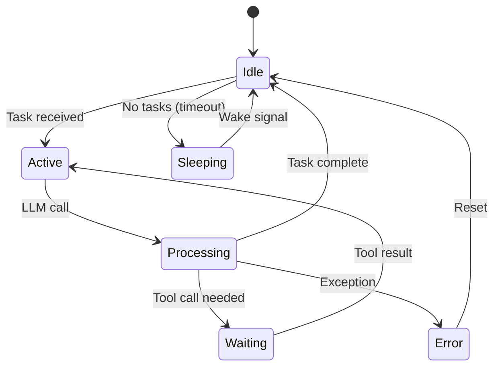
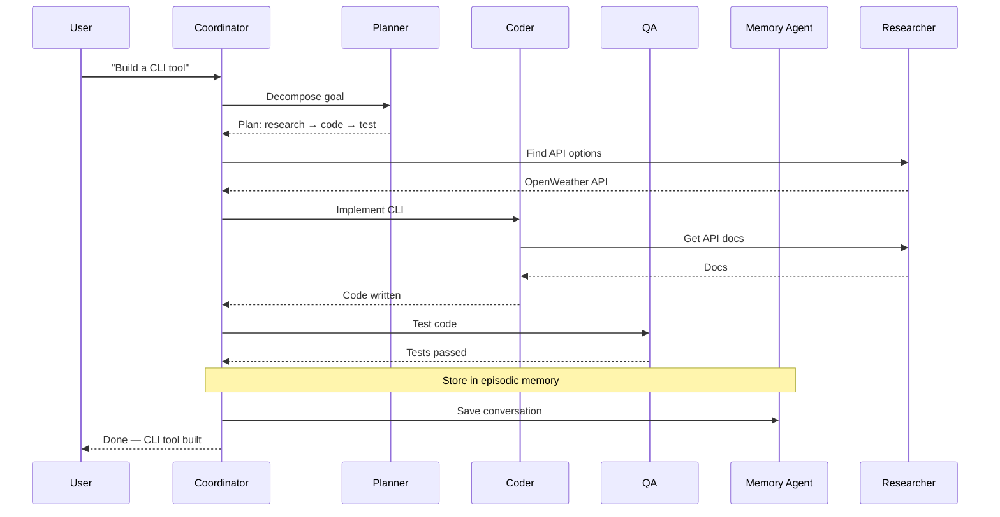

# Agents

Chakravyuh AI uses a **mesh of specialized agents**, each with a single domain responsibility. Agents communicate via structured messages, share memory, and collaborate on complex workflows.

---

## Agent Catalog

### Core Agents

| Agent | Role | Default Provider | Tools | Memory Scope |
|-------|------|------------------|-------|-------------|
| **Coordinator** | Task routing, delegation, escalation | GPT-4o | Registry, Event Bus | Working, Episodic |
| **Planner** | Goal decomposition, workflow design | GPT-4o | None (meta-agent) | Working, Episodic |
| **Coder** | Write, review, refactor code | Capability Router | FileSystem, GitHub, Terminal | Working, Episodic, Procedural |
| **Researcher** | Information gathering, analysis | Cheapest capable | Web Fetch, Web Search | Working, Episodic, Semantic |
| **Browser** | Web automation, interaction | Claude Sonnet 4 | Browser, Web Fetch | Working, Episodic |
| **QA** | Testing, validation | Claude Haiku 3.5 | FileSystem, GitHub, Terminal | Working, Episodic |
| **Memory** | Memory management, retrieval | GPT-4o mini | All memory backends | All |
| **Security** | Threat detection, code audit | Claude Sonnet 4 | FileSystem, GitHub, Terminal | Episodic, Semantic |
| **GitHub** | Repository management, automation | GPT-4o mini | GitHub MCP | Working, Episodic |
| **Deployment** | Build, deploy, infrastructure | GPT-4o | FileSystem, Terminal, Docker | Working, Episodic, Procedural |

### Extended Agents (Planned)

| Agent | Role | Priority |
|-------|------|----------|
| **Data Analyst** | Database queries, charts, NL-to-SQL | v0.3 |
| **DevOps** | Terraform, Kubernetes, CI/CD, monitoring | v0.3 |
| **Comms** | Email, calendar, meeting notes, translation | v0.3 |
| **Learning** | Study plans, flashcards, progress tracking | v0.4 |
| **Legal** | Contract review, compliance checking | v0.4 |
| **Finance** | Expense tracking, budgeting, forecasting | v0.4 |

---

## Agent Lifecycle



### States

| State | Description |
|-------|-------------|
| `Idle` | Ready and waiting for tasks |
| `Active` | Processing a task (LLM or tool call) |
| `Processing` | Waiting for LLM completion |
| `Waiting` | Waiting for external tool result |
| `Sleeping` | Low-power mode after inactivity |
| `Error` | Recoverable error, will auto-reset |

---

## Agent Configuration

### TypeScript Interface

```typescript
interface AgentConfig {
  id: string
  name: string
  role: string
  systemPrompt: string
  provider: string | RoutingStrategy
  model: string
  tools: string[]
  memoryScope: MemoryType[]
  allowedPeers: string[]
  limits: {
    maxTokensPerTask: number
    maxConsecutiveCalls: number
    timeout: number
  }
}

type MemoryType = 'working' | 'episodic' | 'semantic' | 'procedural'

interface RoutingStrategy {
  type: 'fixed' | 'fallback' | 'capability' | 'cheapest' | 'fastest' | 'ensemble'
  // Strategy-specific options
}
```

### YAML Config

```yaml
agents:
  coder:
    name: Coder
    role: Write, review, and refactor code
    provider: strategy
    strategy:
      type: capability
      minCapability: code
      prefer: [openai, anthropic]
    systemPrompt: prompts/coder.md
    tools: [filesystem, github, terminal]
    memoryScope: [working, episodic, procedural]
    allowedPeers: [planner, qa, researcher]
    limits:
      maxTokensPerTask: 8192
      maxConsecutiveCalls: 30
      timeout: 120000
```

---

## Communication Protocol

### Message Format

```typescript
interface AgentMessage {
  id: string
  from: string
  to: string | string[]
  type: 'request' | 'response' | 'broadcast' | 'error'
  priority: 'low' | 'medium' | 'high' | 'critical'
  payload: {
    task?: string
    data?: unknown
    context?: Record<string, unknown>
  }
  metadata: {
    timestamp: string
    ttl: number
    traceId: string
    parentId?: string
    correlationId?: string
  }
}
```

### Communication Flow



---

## Custom Agent Development

### BaseAgent Class

```typescript
import { BaseAgent } from '@chakravyuh/core'
import { AgentMessage } from '@chakravyuh/core'

export interface SlackConfig {
  webhookUrl: string
  channel: string
}

export class SlackAgent extends BaseAgent<SlackConfig> {
  async onMessage(message: AgentMessage): Promise<AgentMessage> {
    const { channel, text } = message.payload.data as any
    const result = await this.tools.slack.send({
      channel: channel || this.config.channel,
      text,
    })
    return this.reply(message, { data: result })
  }

  async onError(error: Error, message: AgentMessage): Promise<void> {
    this.logger.error('Slack agent error', { error, messageId: message.id })
    await this.emit('agent.error', { agentId: this.id, error: error.message })
  }
}
```

### Registration

```yaml
agents:
  slack:
    class: "./agents/slack"
    config:
      webhookUrl: "${SLACK_WEBHOOK_URL}"
      channel: "#chakravyuh"
    provider: openai
    model: gpt-4o
    tools: ["slack-mcp"]
    memoryScope: [working]
    allowedPeers: [coordinator]
    limits:
      maxTokensPerTask: 1024
      maxConsecutiveCalls: 5
      timeout: 15000
```

### Agent Best Practices

| Practice | Description |
|----------|-------------|
| **Single Responsibility** | Each agent masters one domain |
| **Explicit Capabilities** | Document what each agent can/cannot do |
| **Least Privilege** | Restrict tool access to minimum required |
| **Graceful Degradation** | Handle provider failures with fallback |
| **Idempotency** | Handle duplicate messages safely |
| **Timeout Enforcement** | Always enforce per-task timeouts |
| **Audit Logging** | Log all decisions, actions, and errors |
| **Resource Budgets** | Token and rate limits per agent |

---

## Agent Communication Patterns

### Request-Response
Direct one-to-one communication between two agents.

### Broadcast
An agent broadcasts to all peers (e.g., memory agent announcing a consolidation).

### Scatter-Gather
Coordinator fans out a task to multiple agents and collects results.

### Pipeline
Sequential processing where each agent passes output to the next.

### Debate
Multiple agents argue different positions, judged by a mediator agent.

---

## Agent Security

| Concern | Mitigation |
|---------|------------|
| Prompt injection | Input sanitization, instruction reinforcement |
| Tool misuse | Capability-based access control |
| Data leakage | Memory scope isolation |
| Infinite loops | Max consecutive calls limit, timeout |
| Peer impersonation | Signed messages via event bus |
| Resource exhaustion | Token budgets, rate limiting |
