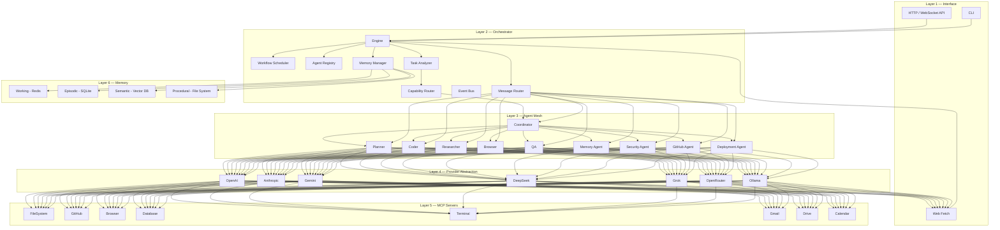
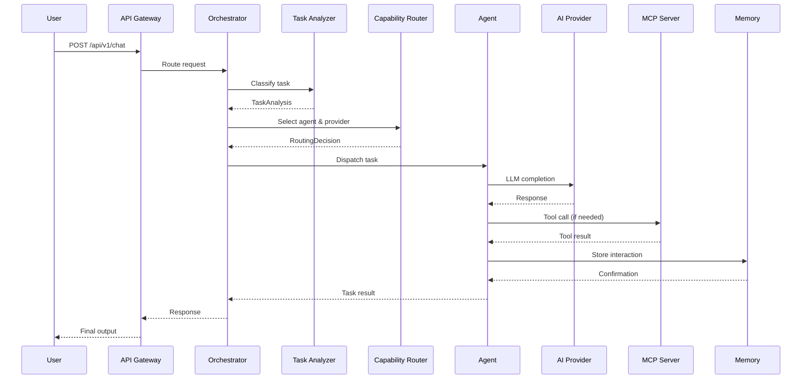
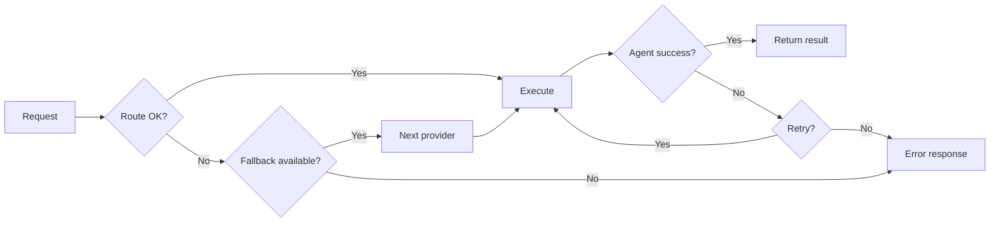
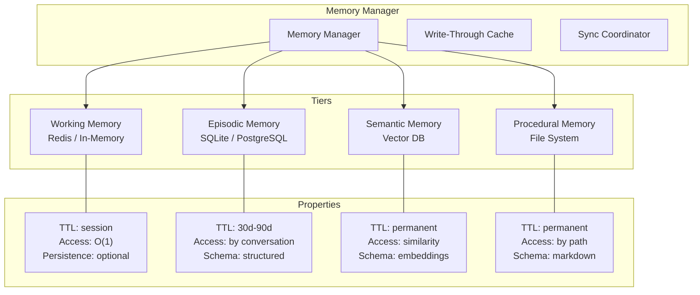
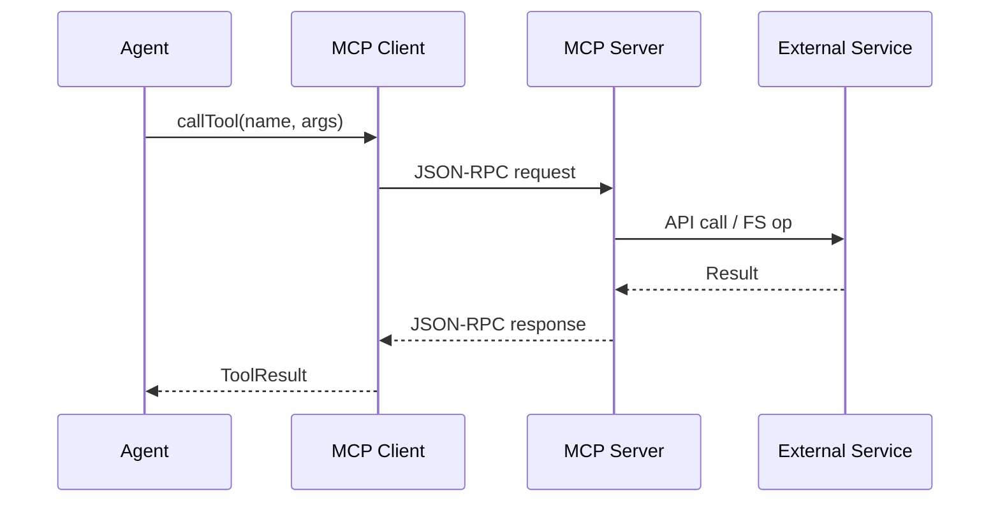
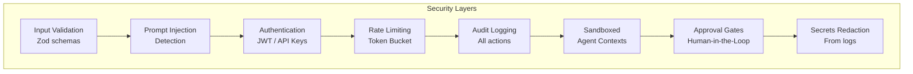

# Architecture

Chakravyuh AI uses a **layered microkernel architecture** with a central orchestrator, a mesh of specialized agents, an abstraction layer over AI providers, and a standardized protocol (MCP) for tool and data access.

---

## Layered Architecture



---

## Core Components

### 1. Orchestrator Engine

The engine is the runtime heart of Chakravyuh. It manages the lifecycle of all subsystems — starting, stopping, and coordinating the router, scheduler, registry, memory manager, and event bus.

**Responsibilities:**
- Bootstrap and shutdown coordination
- Configuration loading and hot-reload
- Health monitoring and circuit breaking
- Graceful degradation on component failure

**Error handling:**
- **Provider failures**: Automatic fallback to next available provider
- **Agent timeouts**: Task re-queued or escalated to human-in-the-loop
- **MCP disconnections**: Automatic reconnection with exponential backoff
- **Memory backend down**: Degraded operation with in-memory fallback

### 2. Message Router

The router handles all inter-agent communication using a structured message protocol.

```typescript
interface AgentMessage {
  id: string
  from: string
  to: string | string[]
  type: 'request' | 'response' | 'broadcast' | 'error'
  priority: 'low' | 'medium' | 'high' | 'critical'
  payload: {
    task?: string
    data?: unknown
    context?: Record<string, unknown>
  }
  metadata: {
    timestamp: string
    ttl: number
    traceId: string
    parentId?: string
    correlationId?: string
  }
}
```

**Routing strategies:**
- **Direct**: Unicast to a specific agent
- **Multicast**: Send to a group of agents
- **Broadcast**: Send to all agents
- **Priority queue**: Critical messages bypass the FIFO queue

### 3. Task Analyzer

Every user request passes through the task analyzer before routing. It classifies the task and determines required capabilities.

```typescript
interface TaskAnalysis {
  type: 'code' | 'research' | 'browse' | 'plan' | 'test' | 'memory' | 'security' | 'deploy'
  complexity: 'simple' | 'moderate' | 'complex'
  requiredCapabilities: Array<'chat' | 'code' | 'vision' | 'reasoning' | 'audio'>
  estimatedTokens: number
  sensitivity: 'normal' | 'sensitive' | 'critical'
  timeout: number
}
```

### 4. Capability Router

The capability router dynamically selects the optimal provider and model for each task.

**Routing strategies:**

| Strategy | Description |
|----------|-------------|
| **Static** | Fixed provider/model per agent |
| **Fallback** | Primary provider → fallback chain |
| **Capability** | Min capability match, cheapest eligible |
| **Cheapest** | Lowest cost among capable models |
| **Fastest** | Lowest latency among capable models |
| **Ensemble** | Multiple providers, majority aggregation |
| **Cost-aware** | Within budget, best quality |

```typescript
interface RoutingDecision {
  provider: string
  model: string
  confidence: number
  estimatedCost: number
  estimatedLatencyMs: number
  alternatives: Array<{ provider: string; model: string }>
}
```

### 5. Agent Registry

Central registry for agent discovery, lifecycle, and health.

```typescript
interface AgentDefinition {
  id: string
  name: string
  role: string
  systemPrompt: string
  provider: string | RoutingStrategy
  model: string
  tools: string[]
  memoryScope: MemoryType[]
  allowedPeers: string[]
  limits: {
    maxTokensPerTask: number
    maxConsecutiveCalls: number
    timeout: number
  }
  health: {
    status: 'healthy' | 'degraded' | 'unhealthy'
    lastHeartbeat: string
    errorCount: number
  }
}
```

### 6. Workflow Scheduler

The scheduler executes declarative multi-step workflows defined in YAML.

```yaml
workflow:
  id: code-review-pipeline
  version: "1.0"
  description: "Review, test, and deploy a feature branch"
  maxRetries: 3
  onFailure: notify_human

  steps:
    - id: analyze
      agent: coder
      task: "Analyze PR #{{ pr_number }} for code quality"
      output: analysis

    - id: test
      agent: qa
      task: "Run tests on {{ steps.analysis.output }}"
      depends_on: [analyze]
      gates:
        - type: condition
          expression: "steps.analysis.status == 'pass'"

    - id: research
      agent: researcher
      task: "Research best practices for {{ steps.analysis.output.language }}"
      parallel: true
      depends_on: [analyze]

    - id: report
      agent: planner
      task: "Combine {{ steps.test.output }} and {{ steps.research.output }}"
      depends_on: [test, research]
      gates:
        - type: human_approval
          message: "Review combined report?"
```

---

## Data Flow

### Request Lifecycle



### Error Flow



---

## Memory Architecture



| Tier | Storage | TTL | Query Type | Use Case |
|------|---------|-----|------------|----------|
| Working | Redis / In-Memory | Session | Key-value | Current conversation, state |
| Episodic | SQLite / PostgreSQL | 30–90 days | SQL | Conversation history |
| Semantic | Vector DB (pgvector, Qdrant, Pinecone) | Permanent | Similarity search | Knowledge, facts |
| Procedural | File System | Permanent | Path-based | Prompts, workflows, templates |

---

## MCP Integration Pattern



---

## Security Architecture



---

## Provider Abstraction

```typescript
interface LLMProvider {
  id: string
  name: string
  models: ModelInfo[]
  complete(req: CompletionRequest): Promise<CompletionResponse>
  stream?(req: CompletionRequest): AsyncIterable<CompletionChunk>
  embed?(input: string[]): Promise<number[][]>
}

interface ModelInfo {
  id: string
  context: number
  capabilities: ModelCapability[]
  cost: { input: number; output: number }
  rateLimit?: { rpm: number; tpm: number }
}

type ModelCapability = 'chat' | 'code' | 'vision' | 'reasoning' | 'audio' | 'embedding'
```

---

## API Endpoints

| Method | Path | Description |
|--------|------|-------------|
| `GET` | `/api/v1/health` | System health check |
| `POST` | `/api/v1/chat` | Send message to agent |
| `POST` | `/api/v1/execute` | Execute named workflow |
| `GET` | `/api/v1/agents` | List registered agents |
| `GET` | `/api/v1/agents/:id` | Agent details & health |
| `GET` | `/api/v1/providers` | List configured providers |
| `GET` | `/api/v1/models` | List available models |
| `GET` | `/api/v1/mcp` | List MCP servers |
| `POST` | `/api/v1/mcp/:id/start` | Start MCP server |
| `POST` | `/api/v1/mcp/:id/stop` | Stop MCP server |
| `GET` | `/api/v1/memory` | Query memory |
| `DELETE` | `/api/v1/memory/:id` | Delete memory entry |
| `GET` | `/api/v1/workflows` | List workflows |
| `GET` | `/api/v1/trace/:traceId` | Request trace |

---

## Directory Layout

```
chakravyuh-ai/
├── backend/
│   └── src/
│       ├── orchestrator/        # Engine, lifecycle, health
│       ├── router/              # Message router, dispatcher
│       ├── scheduler/           # Workflow parser, executor
│       ├── registry/            # Agent & service registry
│       ├── analyzer/            # Task classifier
│       ├── router/              # Capability router
│       ├── providers/           # Provider implementations
│       │   ├── openai/
│       │   ├── anthropic/
│       │   ├── google/
│       │   ├── deepseek/
│       │   ├── grok/
│       │   ├── openrouter/
│       │   └── ollama/
│       ├── memory/              # Memory interfaces
│       ├── mcp/                 # MCP client manager
│       ├── api/                 # HTTP/WS server
│       ├── events/              # Event bus
│       ├── security/            # Auth, audit, injection detection
│       └── config/              # Config loader
├── agents/                      # Agent definitions
│   ├── coordinator/
│   ├── planner/
│   ├── coder/
│   ├── researcher/
│   ├── browser/
│   ├── qa/
│   ├── memory/
│   ├── security/
│   ├── github/
│   └── deployment/
├── mcp/
│   ├── client/                  # MCP client SDK
│   └── servers/                 # Custom MCP server implementations
├── memory/
│   └── drivers/                 # Storage backend drivers
├── config/                      # Runtime YAML configs
├── scripts/                     # Dev, build, deploy scripts
├── prompts/                     # Agent system prompt templates
├── tests/                       # Test suites
├── examples/                    # Usage examples
└── docs/                        # Documentation
```
