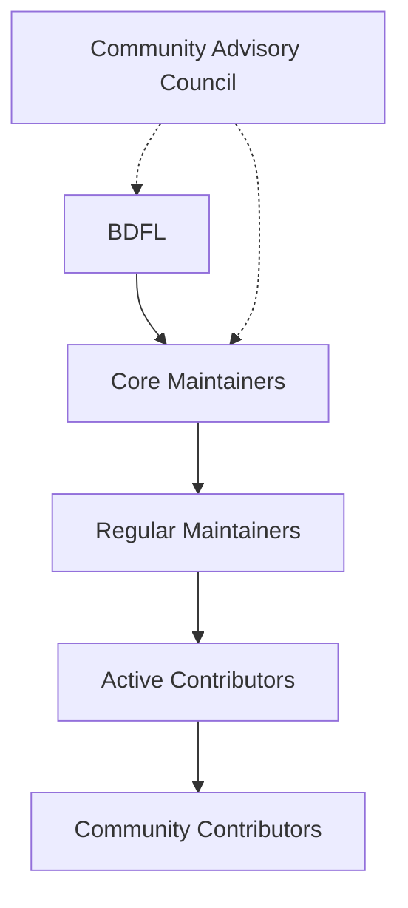
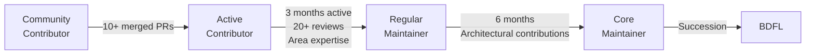

# Governance

---

## Model

Chakravyuh AI follows a **BDFL (Benevolent Dictator for Life)** model with progressive decentralization. As the community grows, governance authority transitions from the BDFL to a distributed set of core maintainers.

**Phases:**

| Phase | Period | Governance Model |
|-------|--------|-----------------|
| 1 — Founding | v0.1–v0.3 | BDFL |
| 2 — Growth | v0.4–v1.0 | BDFL + Core Maintainers |
| 3 — Maturity | v1.0+ | Core Team + Community Council |

---

## Structure

---

## Roles & Responsibilities

| Role | Privileges | Responsibilities |
|------|-----------|-----------------|
| **BDFL** | Final decision authority, strategic direction | Dispute resolution, vision, community health |
| **Core Maintainer** | Full write access, release authority, veto power | Architecture decisions, code review, mentoring, RFC approvals |
| **Regular Maintainer** | Write access to specific areas, PR merge rights | Area ownership, PR review, issue triage, documentation |
| **Active Contributor** | No direct write access | Regular contributions, community support, code reviews |
| **Community Contributor** | No direct write access | Occasional PRs, bug reports, discussions |

---

## Decision Making

### RFC Process

Significant changes require a Request for Comments (RFC):

1. **Proposal**: Open a GitHub Discussion with `[RFC]` prefix
2. **Discussion**: Minimum 7-day comment period
3. **Revision**: Author revises based on feedback
4. **Decision**: Core maintainers vote
5. **Implementation**: Approved RFCs are implemented

### Consensus

- **Lazy Consensus**: Default approval — 7 days without objection
- **Explicit Consensus**: Vote required for security, API, or governance changes
- **Escalation**: BDFL decides if consensus fails after 14 days

### Voting

| Matter | Eligible Voters | Threshold | Voting Period |
|--------|----------------|-----------|---------------|
| New Core Maintainer | Core + BDFL | 2/3 majority | 7 days |
| New Regular Maintainer | Core | Simple majority | 5 days |
| Release Approval | Core + BDFL | BDFL approval | — |
| RFC Approval | Core | Simple majority after 7d | 7 days |
| BDFL Succession | All maintainers | 3/4 majority | 14 days |
| Governance Amendment | Core + BDFL | 2/3 majority | 14 days |
| License Change | All maintainers | 4/5 majority | 30 days |

---

## Progression Path

### Criteria

| Promotion | Criteria |
|-----------|----------|
| Community → Active | 10+ merged PRs, positive community engagement |
| Active → Regular | 3+ months sustained activity, 20+ code reviews, demonstrated area expertise |
| Regular → Core | 6+ months as Regular Maintainer, architectural contributions, mentoring |
| Core → BDFL | Succession vote, 3/4 maintainer majority |

---

## Meetings

- **Weekly maintainer sync**: Technical coordination (core + regular maintainers)
- **Monthly community call**: Open to all — roadmap updates, demos, Q&A
- **Quarterly planning**: Priority setting and milestone planning

---

## Communication

| Channel | Purpose | Audience |
|---------|---------|----------|
| GitHub Issues | Bug reports, feature requests | Public |
| GitHub Discussions | RFCs, Q&A, ideas | Public |
| Discord | Real-time chat, support | Public |
| Maintainer Slack | Internal coordination | Maintainers only |

---

## Code of Conduct

All community members must follow our [Code of Conduct](CODE_OF_CONDUCT.md). Reports should be sent to **conduct@chakravyuh.dev**.

---

## License

All contributions to Chakravyuh AI are under the [Apache 2.0 License](../LICENSE). Contributors retain copyright of their contributions but grant the project a perpetual, irrevocable license.

---

## Amendments

This governance document can be amended by a 2/3 majority vote of core maintainers with BDFL approval.
