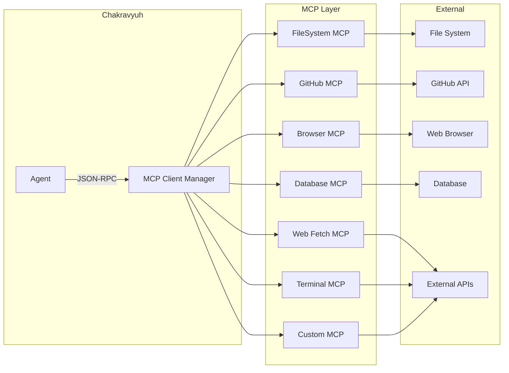
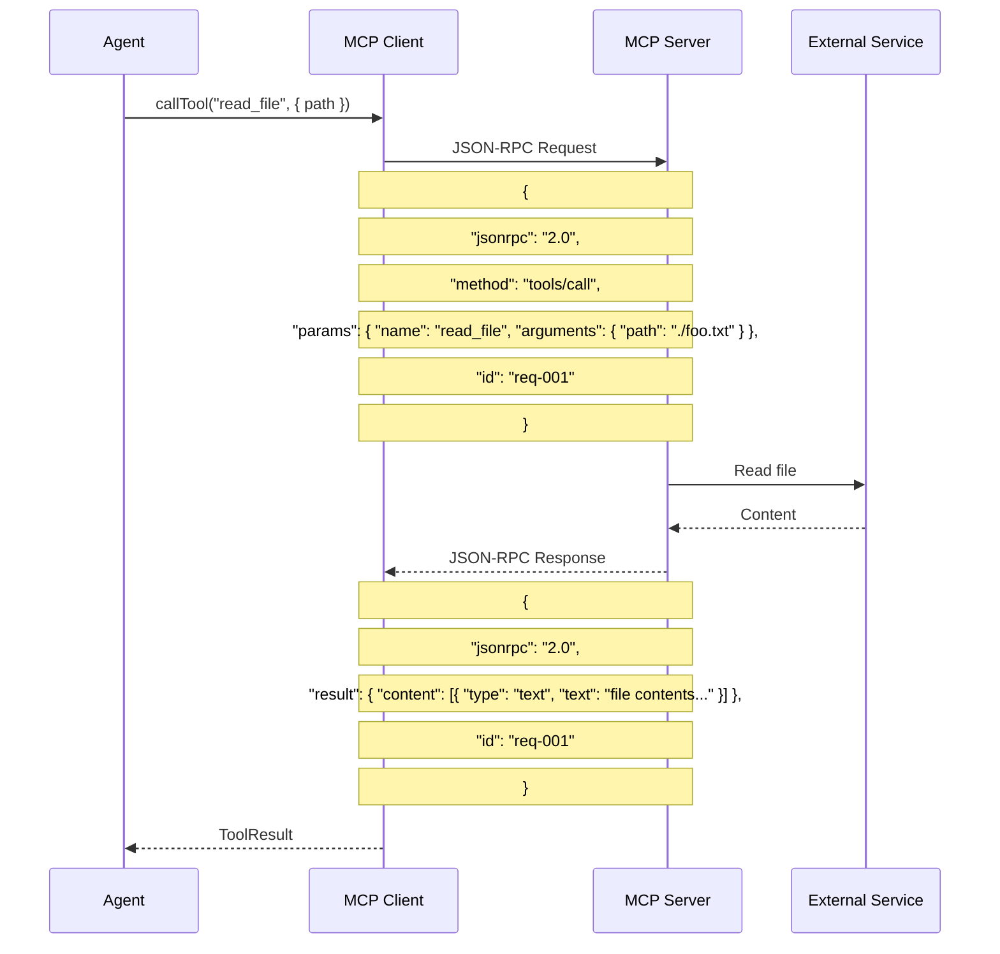

# MCP Servers

> **⚠ Legacy Document (v0.1 TypeScript)** — The system now uses Python-native tools in [`tools/`](../tools/).  
> See `tools/base.py` for the tool interface, and individual tool files for implementations.

---

## Architecture



### MCP Protocol Flow



---

## Core MCP Servers

### FileSystem Server

Provides file read, write, edit, and search operations within allowed directories.

| Tool | Parameters | Description |
|------|------------|-------------|
| `read_file` | `path: string` | Read file contents |
| `write_file` | `path, content: string` | Write/overwrite file |
| `edit_file` | `path, old, new: string` | Find-and-replace edit |
| `list_directory` | `path: string` | List directory contents |
| `create_directory` | `path: string` | Create directory recursively |
| `delete_file` | `path: string` | Delete file or empty dir |
| `move_file` | `source, destination: string` | Move/rename file |
| `copy_file` | `source, destination: string` | Copy file |
| `search_files` | `pattern, path: string` | Glob/Regex file search |
| `get_file_info` | `path: string` | File metadata |

```json
{
  "server": "filesystem",
  "command": "npx -y @modelcontextprotocol/server-filesystem",
  "allowedDirectories": ["./workspace"]
}
```

**Security**: Restricted to allowed directories only. All operations are logged.

---

### GitHub Server

Repository management, code search, PRs, issues, and more.

| Tool | Parameters | Description |
|------|------------|-------------|
| `create_or_update_file` | `owner, repo, path, content, message` | Create or update a file |
| `push_files` | `owner, repo, branch, files[]` | Push multiple files |
| `search_repositories` | `query` | Search GitHub repos |
| `create_issue` | `owner, repo, title, body` | Create an issue |
| `create_pull_request` | `owner, repo, title, body, head, base` | Open a PR |
| `list_issues` | `owner, repo, state` | List repository issues |
| `search_code` | `query` | Search code across GitHub |
| `get_issue` | `owner, repo, issue_number` | Get issue details |
| `add_issue_comment` | `owner, repo, issue_number, body` | Comment on an issue |
| `list_pull_requests` | `owner, repo, state` | List PRs |
| `merge_pull_request` | `owner, repo, pull_number` | Merge a PR |
| `get_repository` | `owner, repo` | Get repository details |
| `list_branches` | `owner, repo` | List repository branches |

```json
{
  "server": "github",
  "command": "npx -y @modelcontextprotocol/server-github",
  "env": { "GITHUB_TOKEN": "${GITHUB_TOKEN}" }
}
```

**Required permissions**: `repo` scope for private repos, `public_repo` for public repos.

---

### Browser Server

Headless web browser automation for navigation, interaction, and data extraction.

| Tool | Parameters | Description |
|------|------------|-------------|
| `navigate` | `url: string` | Navigate to a URL |
| `click` | `selector: string` | Click an element |
| `type` | `selector, text: string` | Type text into an input |
| `select` | `selector, value: string` | Select dropdown option |
| `hover` | `selector: string` | Hover over element |
| `extract` | `selector: string` | Extract text from element |
| `extract_all` | `selector: string` | Extract all matching elements |
| `screenshot` | `selector?: string` | Take a screenshot |
| `scroll` | `direction, amount` | Scroll the page |
| `get_html` | — | Get full page HTML |
| `get_url` | — | Get current URL |
| `wait` | `ms: number, selector?: string` | Wait for condition |
| `evaluate` | `script: string` | Execute JS in page context |

```json
{
  "server": "browser",
  "command": "npx -y @anthropic/server-browser",
  "env": { "HEADLESS": "true" }
}
```

---

### Web Fetch Server

HTTP requests and web search capabilities.

| Tool | Parameters | Description |
|------|------------|-------------|
| `fetch` | `url, headers?: object, method?: string, body?: string` | Make HTTP request |
| `search` | `query, count?: number` | Web search |

```json
{ "server": "web-fetch", "command": "npx -y @anthropic/server-web-fetch" }
```

---

### Database Server

SQL database querying and schema exploration.

| Tool | Parameters | Description |
|------|------------|-------------|
| `query` | `sql: string` | Execute SQL query |
| `list_tables` | — | List database tables |
| `describe_table` | `table: string` | Describe table schema |

```json
{
  "server": "database",
  "command": "npx -y @anthropic/server-postgres",
  "env": { "DATABASE_URL": "${DATABASE_URL}" }
}
```

---

### Terminal Server

Safe command execution within allowed commands.

| Tool | Parameters | Description |
|------|------------|-------------|
| `run_command` | `command, args[]` | Execute whitelisted command |
| `get_output` | `session_id: string` | Get command output |
| `list_processes` | — | List running processes |

```json
{
  "server": "terminal",
  "command": "npx -y @chakravyuh/server-terminal",
  "allowedCommands": ["npm", "git", "node", "tsc", "python3", "docker"],
  "cwd": "./workspace"
}
```

**Security**: Only whitelisted commands can be executed. Each command runs with a timeout.

---

## Planned MCP Servers

| Server | Status | Description |
|--------|--------|-------------|
| **Gmail** | Planned | Read, send, search emails |
| **Google Drive** | Planned | File management, document creation |
| **Google Calendar** | Planned | Event management, scheduling |
| **Slack** | Planned | Messages, channels, threads |
| **Jira** | Planned | Issues, sprints, boards |
| **Notion** | Planned | Databases, pages, search |
| **Stripe** | Planned | Payments, invoices, customers |
| **AWS** | Planned | Cloud resource management |
| **Docker** | Planned | Container management |
| **Kubernetes** | Planned | Pod, deployment, service management |
| **Redis** | Planned | Key-value operations |
| **Puppeteer/Playwright** | Planned | Advanced browser automation |

---

## Custom MCP Server

### Python

```python
from mcp.server import Server, NotificationOptions
from mcp.server.models import InitializationOptions
from mcp.types import Tool, TextContent
import httpx

server = Server("weather-server")

@server.list_tools()
async def handle_list_tools():
    return [
        Tool(
            name="get_weather",
            description="Get current weather for a city",
            inputSchema={
                "type": "object",
                "properties": {
                    "city": {"type": "string", "description": "City name"},
                    "units": {"type": "string", "enum": ["celsius", "fahrenheit"]}
                },
                "required": ["city"]
            }
        )
    ]

@server.call_tool()
async def handle_call_tool(name: str, arguments: dict):
    if name == "get_weather":
        async with httpx.AsyncClient() as client:
            resp = await client.get(
                f"https://api.weather.com/v1/{arguments['city']}"
            )
            return [TextContent(type="text", text=resp.text)]
    raise ValueError(f"Unknown tool: {name}")

async def run():
    async with server.run_stdio():
        pass
```

### Node.js / TypeScript

```typescript
import { Server } from '@modelcontextprotocol/sdk/server/index.js'
import { StdioServerTransport } from '@modelcontextprotocol/sdk/server/stdio.js'
import {
  CallToolRequestSchema,
  ListToolsRequestSchema,
} from '@modelcontextprotocol/sdk/types.js'

const server = new Server(
  { name: 'weather-server', version: '1.0.0' },
  { capabilities: { tools: {} } }
)

server.setRequestHandler(ListToolsRequestSchema, async () => ({
  tools: [{
    name: 'get_weather',
    description: 'Get current weather for a city',
    inputSchema: {
      type: 'object',
      properties: {
        city: { type: 'string' },
        units: { type: 'string', enum: ['celsius', 'fahrenheit'] }
      },
      required: ['city']
    }
  }]
}))

server.setRequestHandler(CallToolRequestSchema, async (request) => {
  if (request.params.name === 'get_weather') {
    const { city } = request.params.arguments
    // Fetch weather data...
    return {
      content: [{ type: 'text', text: `Weather data for ${city}` }]
    }
  }
  throw new Error(`Unknown tool: ${request.params.name}`)
})

const transport = new StdioServerTransport()
await server.connect(transport)
```

---

## MCP Configuration

```yaml
# config/mcp.yaml
servers:
  filesystem:
    enabled: true
    autoStart: true
    command: npx -y @modelcontextprotocol/server-filesystem
    args: ["--allowed", "./workspace"]
    env: {}

  github:
    enabled: true
    autoStart: false
    command: npx -y @modelcontextprotocol/server-github
    args: []
    env: { GITHUB_TOKEN: "${GITHUB_TOKEN}" }

  browser:
    enabled: false
    autoStart: false
    command: npx -y @anthropic/server-browser
    args: []
    env: { HEADLESS: "true" }
```

---

## CLI Commands

```bash
chakravyuh mcp list                    # List all configured servers
chakravyuh mcp start <server>          # Start an MCP server
chakravyuh mcp stop <server>           # Stop an MCP server
chakravyuh mcp restart <server>        # Restart an MCP server
chakravyuh mcp logs <server>           # View server logs
chakravyuh mcp status                  # Show server statuses
```

---

## Security Best Practices

| Concern | Mitigation |
|---------|------------|
| File access | Restrict to allowed directories only |
| Credentials | Use environment variables, never hardcode |
| Command injection | Validate all tool parameters with Zod schemas |
| Resource exhaustion | Set timeouts and rate limits per server |
| Network access | Run untrusted servers in isolated network |
| Data exfiltration | Audit log all MCP operations |
| Server crash | Auto-restart with exponential backoff |
