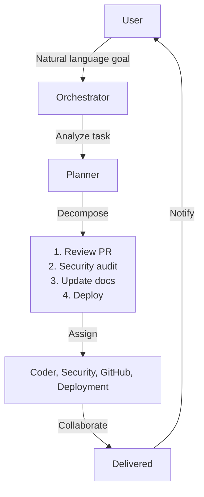

# Vision

---

## The Problem

AI ecosystems today are fragmented. Each provider has its own API, models, tools, and conventions. Multi-step agent workflows require significant custom engineering to connect different services. Memory is ephemeral — lost between sessions. Agent collaboration is ad-hoc, without structured communication or shared context.

**Current limitations:**
- Vendor lock-in to a single AI provider
- No standardized tool protocol for agents
- Memory is not treated as a first-class system primitive
- Multi-agent systems require bespoke engineering
- No unified way to manage costs across providers
- Local/offline models are an afterthought

---

## The Solution

Chakravyuh AI is a **unified runtime for multi-agent AI systems** — an AI Operating System that abstracts away the complexity of multiple providers, tools, and memory systems.

### Core Philosophy

- **Any Model** — Unified interface over OpenAI, Anthropic, Google, DeepSeek, Grok, OpenRouter, Ollama, and any open-source model. Swap models freely without code changes.
- **Any Tool** — MCP (Model Context Protocol) provides a standardized way for agents to interact with files, GitHub, browsers, databases, and any future tool.
- **Any Agent** — Specialized agents communicate, delegate, and collaborate via structured messaging. Each agent masters one domain.
- **Persistent Memory** — Four-tier memory architecture (working, episodic, semantic, procedural) treats memory as a first-class system primitive.
- **Autonomous Execution** — Declarative workflows with automatic planning, execution, and recovery. Human oversight via approval gates.

---

## Design Principles

### Provider Agnostic
No single vendor lock-in. Users connect their own API keys. Models can be swapped, chained in fallback order, combined in ensembles, or selected by capability. The orchestration layer is independent of any specific provider.

### Agent Specialization
Each agent masters one domain — coding, research, browsing, testing, security. Collaboration emerges from structured inter-agent communication. Agents are designed to be composed, not monolithic.

### Open Standards
MCP for tools, OpenTelemetry for observability, REST/WebSocket for API, JSON-RPC for inter-agent communication, YAML for configuration. No proprietary protocols. Interoperable by design.

### Memory as Core
Memory is not an add-on — it is a first-class system primitive. Four memory tiers with different performance, persistence, and query characteristics. Memory is shared (with controls), consolidated, and searchable.

### Autonomous by Default
Agents operate independently within guardrails. Tasks are decomposed, delegated, and executed autonomously. Human intervention is reserved for sensitive decisions via approval gates, not required for routine operations.

### Security by Design
Prompt injection detection, capability-based access control, audit logging, secrets redaction, sandboxed execution contexts. Security is embedded in the architecture.

---

## North Star

> **Describe goals in natural language. Chakravyuh plans, delegates, executes, and delivers — coordinating a team of AI agents like human specialists working together.**

### What This Looks Like

```bash
# User types:
chakravyuh run "Review the latest PR, check for security issues,
                update the documentation, and deploy to staging"
```



### Future State

- **Autonomous operations**: Chakravyuh runs 24/7, handling tasks as they arrive
- **Cross-session memory**: Remembers context across days, learns preferences
- **Multi-modal**: Handles text, images, audio, and video
- **Agent training**: Improves agents from interaction history
- **Edge deployment**: Runs on Raspberry Pi, mobile, IoT
- **Agent marketplace**: Community agents for every domain

---

## Status

| Phase | Description | Timeline |
|-------|-------------|----------|
| **Pre-Alpha** | Architecture, planning, documentation | Q2–Q3 2026 |
| **Alpha** | Core engine, providers, basic agents | Q3–Q4 2026 |
| **Beta** | Autonomous workflows, memory, routing | Q1–Q2 2027 |
| **Stable** | Production-ready, plugin ecosystem | Q3–Q4 2027 |
